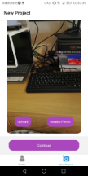
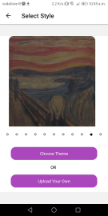

# Usage

## Test the App on Master branch!

1. Download [Expo Go](https://expo.dev/client)
2. Scan the [QR code](https://expo.dev/@tcd-paint-yourself/paint-yourself-app)
3. Do whatever you want with the app.

## user_experience

1. Login (with Google)
2. Enter Landing Page  
   
3. Create New Project  
   
4. Upload or Take a Picture  
   
5. Confirm Selection  
   
6. Select Style  
   
7. Select Sub-style  
   
8. Wait for a few seconds...
9. Evaluate the result!  
   
10. Share or Save
11. Updated Landing page  
   

# Development

## Clone the Repo

`git clone https://github.com/TCDPaintYourself/paint-yourself-app.git`

## Creating and checking out to branch

`git checkout -b my-branch`

## Make a commit and create a pull request for review

- Include screenshots and any comments about anything that might be difficult to understand

### Expo quick start

- Install Node
- `npm install --global expo-cli`
- `npm run web` - to run the expo app on web
